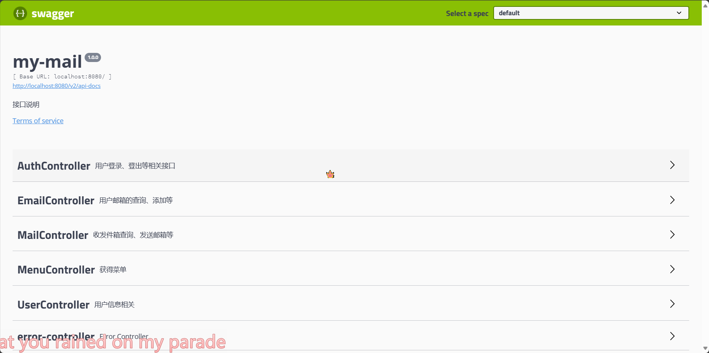
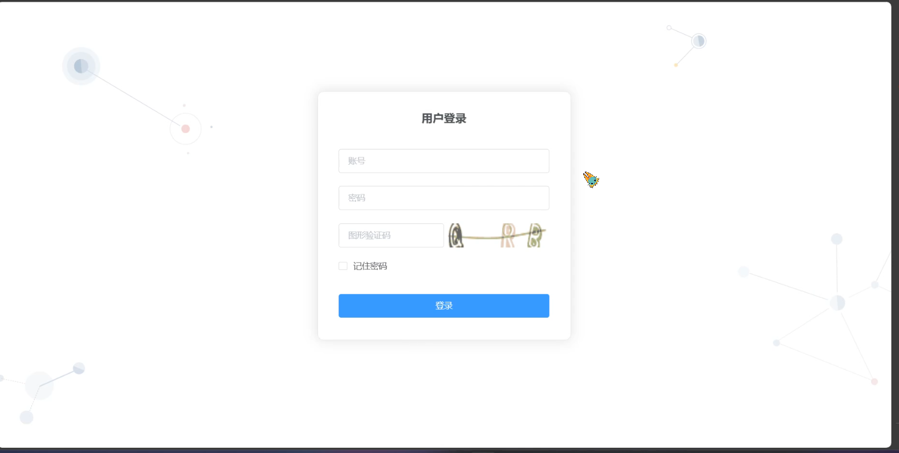
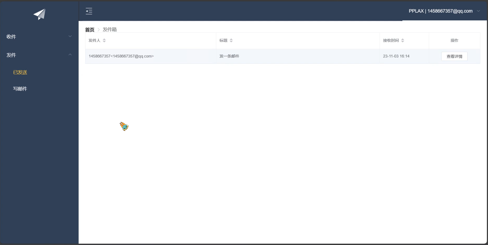
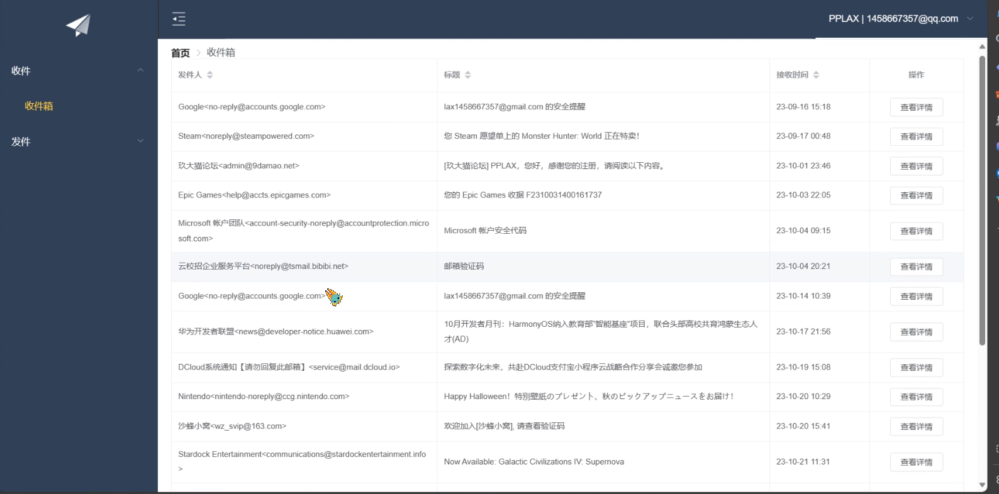
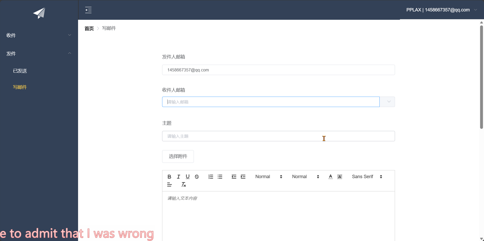

# my-email

## 邮箱系统，公司面试作业 目标效果是类似qq邮箱那种，使用一个账号，这个账号下可以管理多个自己邮箱

‍

## 目前做到的功能如下

#### 基本功能

1. 项目使用账号登录，这个账号下可以管理多个邮箱，邮箱目前支持qq邮箱，其他的暂时还没测试
2. 账号当前使用的邮箱可以查看收、发件箱，邮件详情支持html文本，邮件附件可以下载
3. 可以发邮箱，邮箱可以添加附件

#### 安全方面

1. 对接口进行限流，防止反复请求查看收发件箱等手段导致邮箱被封
2. 使用缓存记录在这个项目下指定邮箱在一定时间段的发送、接收次数，防止多次请求发送邮箱相关的攻击行为
3. 登录密码使用密文传输（持久化保存的密码还是明文，本来想用加密盐+MD5的方式来着，但是这是拿我过去写的代码二开的，要改的话重构的地方有点多，不过我还是有这个想法的，在这里先记下了），加密方法经过混淆处理

#### 后续计划

1. 把其他的邮箱类型也搞定了
2. 继续重构发送邮箱的相关方法，过去写的有点烂
3. 密码持久化存储重构，如果这个能搞好，看看能不能继续重构成spring security的
4. 既然都用上sentinel了，那将来spring cloud alibaba那一套就安排上吧（有时间的话）

## 技术栈

​`Spring Boot`​ `My Batis`​ `Swagger`​ `Redis`​ `Sentinel`​ `MySQL`​ `Docker`​

​`Vue`​ `Element-ui`​

‍

## 环境

Java 8

MySQL 8.0.33

Redis 7.0.5

npm 6.14.16

sentinel-dashboard:1.8.2

‍

### 展示

swagger: [http://localhost:8080/swagger-ui.html#/](http://localhost:8080/swagger-ui.html#/)

​​

‍

页面

​​

​​

​​

​​

​​

​​​​

‍

‍

## Docker

### redis

```yaml
version: '3'
services:
  redis:
    image: registry.cn-hangzhou.aliyuncs.com/zhengqing/redis:7.0.5                    # 镜像'redis:7.0.5'
    container_name: redis                                                             # 容器名为'redis'
    restart: unless-stopped                                                                   # 指定容器退出后的重启策略为始终重启，但是不考虑在Docker守护进程启动时就已经停止了的容器
    command: redis-server /etc/redis/redis.conf --requirepass 123456 --appendonly no # 启动redis服务并添加密码为：123456,默认不开启redis-aof方式持久化配置
#    command: redis-server --requirepass 123456 --appendonly yes # 启动redis服务并添加密码为：123456,并开启redis持久化配置
    environment:                        # 设置环境变量,相当于docker run命令中的-e
      TZ: Asia/Shanghai
      LANG: en_US.UTF-8
    volumes:                            # 数据卷挂载路径设置,将本机目录映射到容器目录
      - "./redis/data:/data"
      - "./redis/config/redis.conf:/etc/redis/redis.conf"  # `redis.conf`文件内容`http://download.redis.io/redis-stable/redis.conf`
    ports:                              # 映射端口
      - "6379:6379"
```

### Sentinel

```yaml
version: '3'
services:
  sentinel:
    image: registry.cn-hangzhou.aliyuncs.com/zhengqing/sentinel-dashboard:1.8.2
    container_name: sentinel                                     # 容器名为'sentinel'
    restart: unless-stopped                                      # 指定容器退出后的重启策略为始终重启，但是不考虑在Docker守护进程启动时就已经停止了的容器
    environment:                                                 # 设置环境变量,相当于docker run命令中的-e
      TZ: Asia/Shanghai
      LANG: en_US.UTF-8
    ports:                                                       # 映射端口
      - "8858:8858"
```

### MySQL

```yaml
version: '3'
services:
  mysql:
    image: registry.cn-hangzhou.aliyuncs.com/zhengqing/mysql:8.0  # 原镜像`mysql:8.0`
    container_name: mysql8                                    # 容器名为'mysql8'
    restart: unless-stopped                                               # 指定容器退出后的重启策略为始终重启，但是不考虑在Docker守护进程启动时就已经停止了的容器
    volumes:                                                      # 数据卷挂载路径设置,将本机目录映射到容器目录
      - "./mysql/my.cnf:/etc/mysql/my.cnf"
      - "./mysql/data:/var/lib/mysql"
#      - "./mysql/conf.d:/etc/mysql/conf.d"
      - "./mysql/mysql-files:/var/lib/mysql-files"
    environment:                        # 设置环境变量,相当于docker run命令中的-e
      TZ: Asia/Shanghai
      LANG: en_US.UTF-8
      MYSQL_ROOT_PASSWORD: root         # 设置root用户密码
      MYSQL_DATABASE: demo              # 初始化的数据库名称
    privileged: true
    user: root
    ports:                              # 映射端口
      - "3308:3306"
```

‍

## 数据库准备

```sql
drop database if exists myemail_db;

create database if not exists myemail_db;

use myemail_db;

create table `user` (
    `uid` bigint auto_increment comment '主键',
    `username` varchar(30) not null unique comment '用户登录名',
    `password` varchar(30) not null comment '用户登录密码',
    `phone` varchar(11) comment '用户电话',
    `create_time` timestamp NOT NULL DEFAULT CURRENT_TIMESTAMP ON UPDATE CURRENT_TIMESTAMP comment '创建时间',
    primary key (`uid`)
);

insert into user (`username`, `password`) values ('PPLAX', '123456');

create table `email` (
    `email_id` bigint primary key auto_increment comment '主键',
    `uid` bigint not null comment '外键，user',
    `email_address` varchar(50) not null comment '邮箱地址',
    `email_password` varchar(50) not null comment '邮箱密码或授权码',
    `create_time` timestamp NOT NULL DEFAULT CURRENT_TIMESTAMP ON UPDATE CURRENT_TIMESTAMP comment '创建时间'
);

create table `email_log` (
    `log_id` bigint primary key auto_increment comment '主键',
    `uid` bigint comment '外键，user',
    `type` enum('send', 'receive') default 'send' comment '类型',
    `sender_email` varchar(50) not null comment '发件者邮箱',
    `receiver_email` varchar(50) not null comment '收件人邮箱',
    `create_time` timestamp NOT NULL DEFAULT CURRENT_TIMESTAMP ON UPDATE CURRENT_TIMESTAMP comment '创建时间'
);

create table `menu` (
    `menu_id` integer primary key auto_increment comment '主键',
    `icon` varchar(30) default '' comment '图标',
    `name` varchar(30) default '' comment '选项名',
    `url` varchar(30) comment '跳转地址',
    `parent_menu_id` integer comment '父级菜单id'
);

# insert into `menu` (menu_id, icon, name, url, parent_menu_id) values (1, '', '收件', '', null), (2, '', '发件', '', null), (3, '', '收件箱', 'receive/emails', 1), (4, '', '垃圾邮箱', 'receive/spam', 1), (5, '', '已发送', 'send/sent', 2), (6, '', '写邮件', 'send/write', 2);

insert into `menu` (menu_id, icon, name, url, parent_menu_id) values (1, '', '收件', '', null), (2, '', '发件', '', null), (3, '', '收件箱', 'receive/emails', 1), (4, '', '已发送', 'send/sent', 2), (5, '', '写邮件', 'send/write', 2);

```

## 前端

cd到`vueproject`​目录下

```bash
npm install
```

```bash
npm run dev
```

‍
